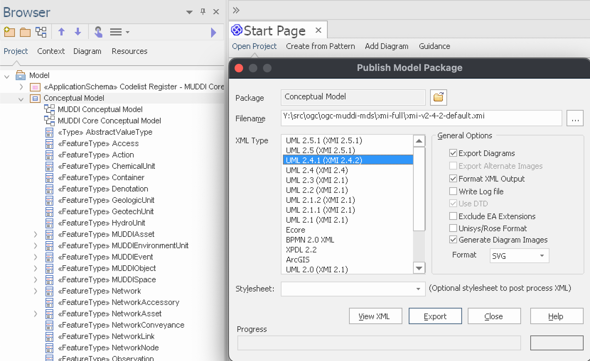

= OGC MUDDI Model-Driven Standard data dictionary

//image:https://github.com/metanorma/ogc-muddi-mds/workflows/generate/badge.svg["Build Status", link="https://github.com/metanorma/ogc-muddi-mds/actions?query=workflow%3Agenerate"]
//image:https://github.com/metanorma/ogc-muddi-mds/workflows/docker/badge.svg["Docker Build Status", link="https://github.com/metanorma/ogc-muddi-mds/actions?query=workflow%3Adocker"]

== General

This repository contains the source files for the OGC MUDDI model-based
standard.

== Structure

`sources/`::
document source of the MUDDI standard

`xmi-full/`::
the full XMI exported from Enterprise Architect of the MUDDI EA file.

`site/`::
(automatically generated, in the `gh-pages` branch) published document.

== Usage

This is a Metanorma repository.

== Running via Docker or locally

If you have installed the build tools locally, and wish to run the
locally-installed compilation tools, there is nothing further to set.

If you don't want to deal with local dependencies, use the docker:

[source,sh]
----
docker run -v "$(pwd)":/metanorma -w /metanorma -it metanorma/mn metanorma site generate
----

== Building The Document

[source,sh]
----
metanorma site generate
----

== Exporting the MUDDI EA model to XMI with diagrams

. Open the `MUDDI_Conceptual_Model_v0.9.eap` file in Enterprise Architect
(https://portal.opengeospatial.org/files/?artifact_id=90837[source])

. Select the "`MUDDI`" package *only*. The `MUDDI_Conceptual_Model_v0.9.eap`.

. Click on the "`Publish`" tab on the ribbon bar

. Click on "`Export-XML`", then select "`Export XML for Current Package...`"

. Click on the "`Publish`" button next to "`Other Formats:`"

. Select the "`UML 2.4.1 (XMI 2.4.2)`" XML Type if not already selected.
  Ensure that only these options are ticked:
** Export Diagrams
** Format XML Output
** Generate Diagram Images (select the "`Metafile`" Format for vector images)

. Your options should look like this ("`Stylesheet:`" must be empty): +
+

. Click "`Export`"

. Voila!

== License

This work is performed by Ribose Limited on behalf of OGC.
The copyright of such documents (as well as their converted text) remain
unchanged.
